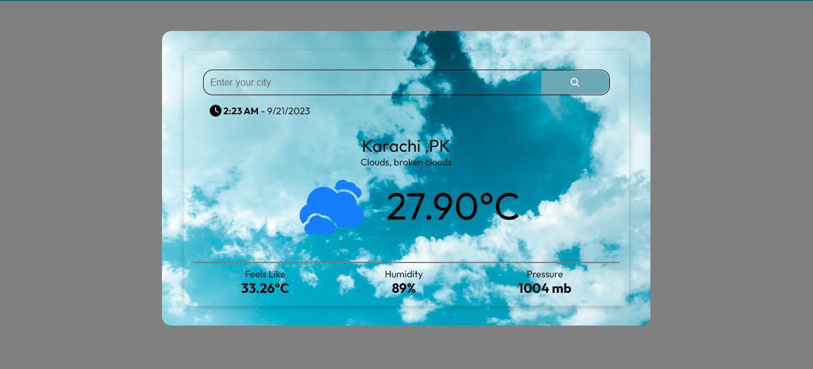
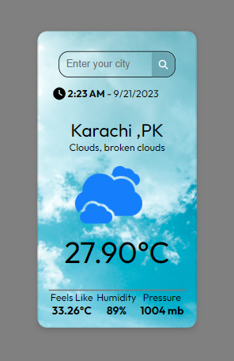

# Weather App

## Table of contents

- [Overview](#overview)
  - [Screenshot](#screenshot)
  - [Links](#links)
- [My process](#my-process)
  - [Built with](#built-with)
- [Author](#author)

## Overview

### Screenshot

### Links

- Live Site URL: https://weather-app-react-ecru-one.vercel.app/

## My process

### Built with

- React Js
- JSX
- CSS modules
- JavaScript
- Fetch API - JavaScript API for making HTTP requests.

## Author

- Website - [Muhammad Kabir Kaka](https://www.your-site.com)
- Frontend Mentor - [@KabirKaka](https://www.frontendmentor.io/profile/KabirKaka)
- Linkedin - [@Muhammad Kabir Kaka](https://www.linkedin.com/in/muhammad-kabir-kaka/)

